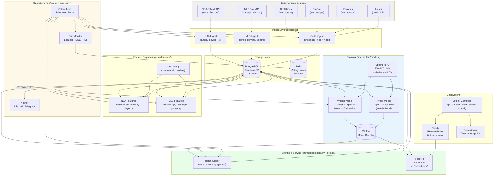
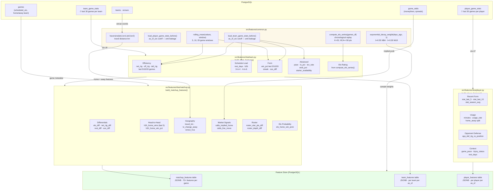
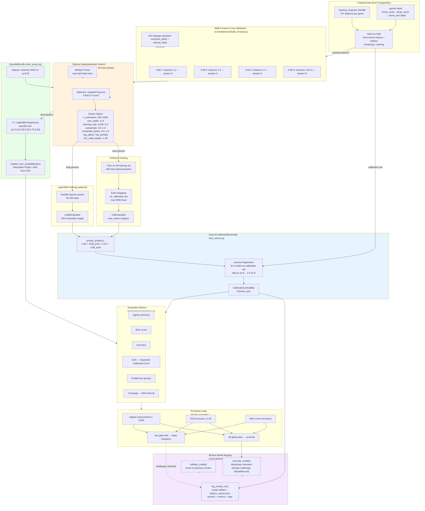
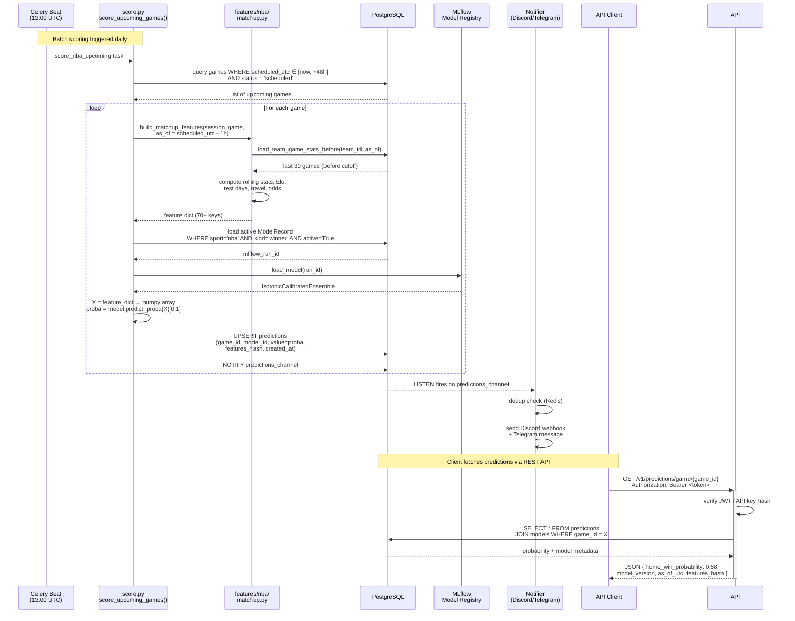
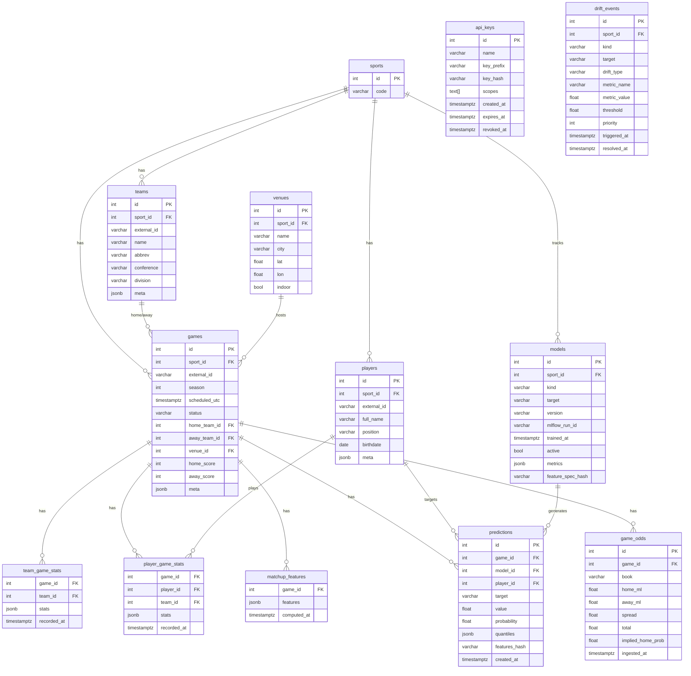
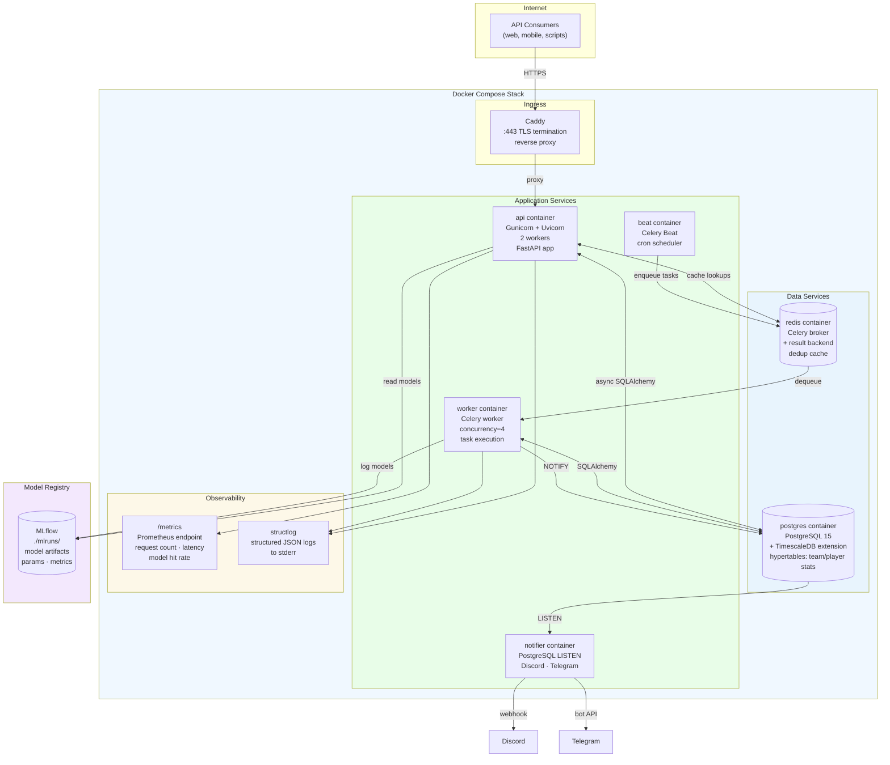
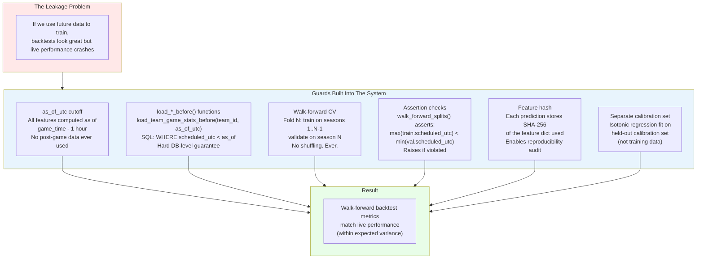

# Prediction Engine — Architecture Diagrams

> Custom-built end-to-end ML system for NBA & MLB game outcome and player prop prediction.
> No third-party prediction API. Every component — data ingest, feature engineering, model training, serving, and drift monitoring — is built in-house.

---

## 1. System Overview

---

## 2. Data Ingestion Pipeline

```mermaid
flowchart TD
    subgraph Sources["External Sources"]
        N1["nba_api<br/>(stats.nba.com)"]
        M1["MLB-StatsAPI<br/>(statsapi.mlb.com)"]
        O1["DraftKings API"]
        O2["FanDuel API"]
        O3["Fanatics API"]
        O4["Kalshi Public API"]
    end

    subgraph RateLimit["src/ingest/common.py"]
        RL["RateLimitedClient<br/>1 req/sec · UA rotation<br/>Tenacity retry"]
        IR["IngestResult<br/>rows_inserted · errors"]
    end

    subgraph NBA["src/ingest/nba/"]
        NS["ingest_season_schedule()<br/>games table"]
        NB["ingest_box_scores()<br/>team_game_stats<br/>player_game_stats"]
        NP["sync_teams() / sync_players()<br/>teams · players tables"]
        NL["poll_live_nba()<br/>every 2 min · live games"]
    end

    subgraph MLB["src/ingest/mlb/"]
        MS["ingest_season_schedule()"]
        MB["ingest_box_scores()"]
        MP["sync_teams() / sync_players()"]
        MW["ingest_mlb_weather()"]
        ML["poll_live_mlb()"]
    end

    subgraph Odds["src/ingest/odds/"]
        OC["get_consensus_lines()<br/>average DK + FD + Fanatics"]
        OK["get_kalshi_probs()<br/>prediction market"]
        OA["american_to_implied_prob()<br/>moneyline ↔ probability"]
    end

    subgraph DB["PostgreSQL"]
        G["games"]
        TGS["team_game_stats<br/>⏱ hypertable"]
        PGS["player_game_stats<br/>⏱ hypertable"]
        T["teams"]
        P["players"]
        GO["game_odds"]
    end

    subgraph Schedule["Celery Beat Schedule"]
        S1["09:00 UTC — box scores"]
        S2["11:00 UTC — injuries"]
        S3["14:00 + 22:00 UTC — odds"]
        S4["18:00 UTC — MLB weather"]
        S5["every 2 min — live poll"]
    end

    N1 --> RL --> NS & NB & NP
    N1 --> NL
    M1 --> RL --> MS & MB & MP & MW
    M1 --> ML
    O1 & O2 & O3 --> OC --> OA
    O4 --> OK

    NS --> G
    NB --> TGS & PGS
    NP --> T & P
    MS --> G
    MB --> TGS & PGS
    MP --> T & P
    OA & OK --> GO

    IR -.->|accumulates| NS & NB & NP & MS & MB

    S1 -->|triggers| NB & MB
    S2 -->|triggers| NP & MP
    S3 -->|triggers| OC & OK
    S4 -->|triggers| MW
    S5 -->|triggers| NL & ML

    style DB fill:#e8f4fd
    style Schedule fill:#fdf8e8
```

---

## 3. Feature Engineering Pipeline

---

## 4. Training Pipeline

---

## 5. Live Inference & API Flow

---

## 6. Model Architecture Detail

```mermaid
graph TB
    subgraph WinnerModel["Winner Model — IsotonicCalibratedEnsemble"]
        subgraph Input["Input: 70+ Features (numpy array)"]
            F1["Efficiency: net_rtg, off_rtg, def_rtg (×3 windows)"]
            F2["Schedule: rest_days, b2b, streak, win_pct"]
            F3["Matchup: elo_diff, net_rtg_diff, rest_diff"]
            F4["Market: odds_implied_home, line_move"]
            F5["Context: travel_km, tz_change, venue_hca"]
            F6["Roster: starter_availability, depth_diff"]
        end

        subgraph XGB["XGBoost (Primary, 60%)"]
            X1["n_estimators: 200–3000<br/>max_depth: 3–8<br/>learning_rate: 0.005–0.3"]
            X2["subsample · colsample_bytree<br/>reg_alpha · reg_lambda<br/>min_child_weight"]
            X3["predict_proba(X) → p_xgb"]
        end

        subgraph LGB["LightGBM (Secondary, 40%)"]
            L1["num_leaves: 31–127<br/>learning_rate: 0.01–0.2<br/>feature_fraction: 0.5–1.0"]
            L2["bagging_fraction · bagging_freq<br/>min_child_samples: 5–50"]
            L3["predict_proba(X) → p_lgb"]
        end

        ENS["Ensemble<br/>p_raw = 0.60 × p_xgb + 0.40 × p_lgb"]

        subgraph ISO["Isotonic Calibration"]
            IC["IsotonicRegression()<br/>fit on held-out calibration set<br/>monotone non-decreasing"]
            CLIP["clip(p, 1e-6, 1-1e-6)"]
        end

        OUT_W["P(home_win) ∈ (0, 1)<br/>well-calibrated probability"]
    end

    subgraph PropsModel["Props Model — QuantileBundle"]
        subgraph PInput["Input: 40 Player Features"]
            PF1["Recent: stat_last_5, stat_last_10, stat_season_avg"]
            PF2["Usage: minutes, usage_rate, home_away_split"]
            PF3["Defense: opp_def_rtg_vs_position"]
            PF4["Context: pace, rest_days, b2b"]
        end

        subgraph QB["QuantileBundle (5 LGBMs)"]
            Q10["LGBMRegressor α=0.10 → q10"]
            Q25["LGBMRegressor α=0.25 → q25"]
            Q50["LGBMRegressor α=0.50 → q50 (median)"]
            Q75["LGBMRegressor α=0.75 → q75"]
            Q90["LGBMRegressor α=0.90 → q90"]
        end

        IOP["implied_over_probability(line)<br/>interpolate P(stat > line) from CDF<br/>via scipy.interpolate"]

        OUT_P["quantiles dict + P(over line)"]
    end

    F1 & F2 & F3 & F4 & F5 & F6 --> X1 & L1
    X1 --> X2 --> X3
    L1 --> L2 --> L3
    X3 & L3 --> ENS --> IC --> CLIP --> OUT_W

    PF1 & PF2 & PF3 & PF4 --> Q10 & Q25 & Q50 & Q75 & Q90
    Q10 & Q25 & Q50 & Q75 & Q90 --> IOP --> OUT_P

    style WinnerModel fill:#e8f4fd
    style PropsModel fill:#e8fde8
```

---

## 7. Database Schema

---

## 8. Automated Operations (Celery Schedule)

```mermaid
gantt
    title Daily Automated Pipeline (UTC)
    dateFormat HH:mm
    axisFormat %H:%M

    section Data Ingest
    NBA/MLB Box Scores (yesterday)   :done, 09:00, 1h
    Injury Refresh                   :done, 11:00, 30m
    Odds Ingest (open lines)         :done, 14:00, 30m
    MLB Weather                      :done, 18:00, 20m
    Odds Ingest (closing lines)      :done, 22:00, 30m

    section Features & Scoring
    Rebuild Matchup Features         :active, 12:00, 1h
    Score Upcoming Games             :active, 13:00, 30m
    Re-score on Lineup Changes       :crit, 15:00, 7h

    section Model Ops
    Train Challenger Models (nightly) :done, 02:00, 2h
    Drift Detection                  :done, 03:00, 30m
    Evaluate & Promote               :done, 04:00, 30m

    section Live Monitoring
    Live Game Polling (every 2 min)  :crit, 00:00, 24h
```

---

## 9. Deployment Stack

---

## 10. Anti-Leakage & Model Integrity

---

## What We Built Ourselves

| Component | What We Built | Why It Matters |
|-----------|--------------|----------------|
| **Feature Engineering** | 70+ hand-crafted game and player features: Elo replay, rolling efficiency ratings (net_rtg/pace/TS%), schedule load indicators, H2H history, geographic travel factors, market signals | No off-the-shelf sports ML library does this — all domain knowledge encoded by us |
| **Walk-Forward CV** | Custom chronological splitter with strict season boundary guards and leakage assertions | Standard k-fold would leak future scores into training — we prevented this entirely |
| **IsotonicCalibratedEnsemble** | XGBoost + LightGBM weighted ensemble with isotonic regression calibration on a held-out set | Built and tested the calibration pipeline manually; models output well-calibrated probabilities, not just rankings |
| **QuantileBundle** | 5-quantile LightGBM wrapper with CDF interpolation for P(stat > line) | Custom class that wraps 5 separate regressors and interpolates the over/under probability |
| **Promotion Gate** | Multi-metric challenger vs. champion comparator (logloss + ECE + Brier) | Automated nightly model improvement with guardrails against regressions |
| **Drift Detection** | Rolling 30-game log-loss, ECE, and PSI monitoring with per-metric thresholds | Catches when a deployed model's real-world performance degrades before it causes bad predictions |
| **Ingest Pipeline** | Rate-limited scrapers + official APIs for 4 sportsbooks, 2 leagues, weather | Consensus odds from 3 books; Kalshi prediction market as an independent signal |
| **Anti-leakage architecture** | `as_of_utc` cutoff enforced at every layer (SQL, Python, CV) | Ensures live predictions use only information available at prediction time |
